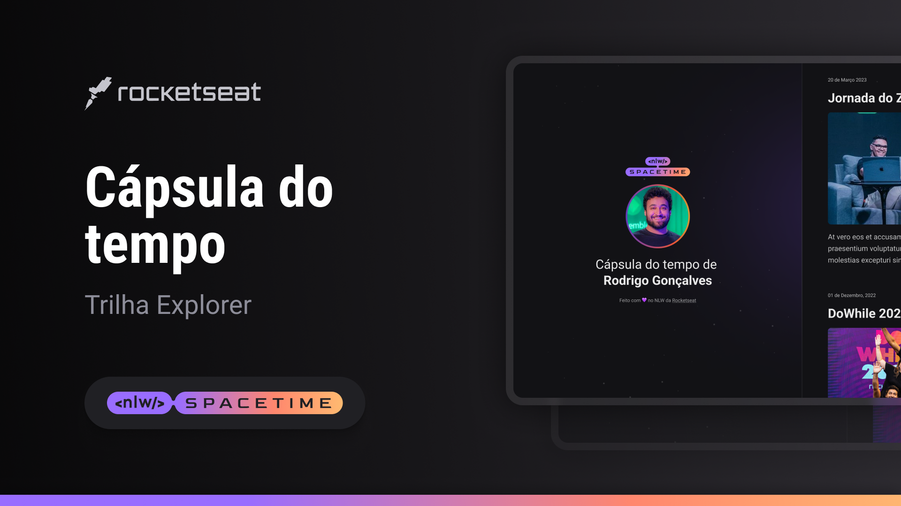

    

## 💻 Projeto

Ele é um projeto web com responsividade simples consiste em uma cápsula do tempo para exibir memórias em uma linha do tempo.

## 🚨 Tecnologias

Este projeto foi desenvolvido durante 5 dias no NLW da Rocketseat com as seguintes tecnologias:

- HTML
- CSS
- GIT e GITHUB

## 💎 Layout

Você pode visualizar o layout do projeto através deste [link](<https://www.figma.com/file/EoSpsfCWGIQ5Ccpby3H0Rd/C%C3%A1psula-do-tempo-%E2%80%A2-Trilha-Explorer-(Community)-(Copy)?type=design&node-id=306%3A84&t=lRxYQK8RQjO2sbwz-1>).
